# AI-Powered Startup Development & Security Testing

> **Complete Tech Stack Guide: From Idea to Customer Acquisition**  
> *Presented at CyberCon Asia 2025*

## 🎯 Overview

This repository contains the complete methodology and tools for building, securing, and scaling startups using AI-powered development workflows. Based on 24 years of entrepreneurial experience, 4 successful startups, and proven at CyberCon Asia 2025.

## 📋 Table of Contents

- [Complete Tech Stack](#-complete-tech-stack)
- [Process Flow](#-process-flow)
- [Tool Details & URLs](#-tool-details--urls)
- [AI Agent Metaprompts](#-ai-agent-metaprompts)
- [Implementation Guide](#-implementation-guide)
- [Security Testing Workflow](#-security-testing-workflow)
- [Resources & Next Steps](#-resources--next-steps)

## 🛠 Complete Tech Stack

### 7 AI Tools Replacing Entire Development Teams

| Stage | Tool | Purpose | Alternative |
|-------|------|---------|-------------|
| **Strategy** | [Abacus.ai Deep Agent](#abacusai-deep-agent) | Market research, business validation | ChatGPT Agent Mode |
| **Development** | [vly.ai](#vlyai) | Full-stack application generation | Firebase + Vercel |
| **Optimization** | [Cursor](#cursor) | AI-powered code enhancement | GitHub Copilot |
| **Deployment** | [Warp](#warp) | Intelligent terminal operations | Traditional CLI |
| **Security** | [Manus](#manus) | AI-orchestrated security testing | Manual penetration testing |
| **Outreach** | [Lindy.ai](#lindyai) | AI sales agent automation | Manual outreach |
| **Leads** | [Apollo](#apollo) | B2B contact database | Manual prospecting |

## 🔄 Process Flow

```mermaid
graph LR
    A[Abacus.ai<br/>Strategy] --> B[vly.ai<br/>Development]
    B --> C[Cursor<br/>Optimization]
    C --> D[Warp<br/>Deployment]
    D --> E[Manus<br/>Security]
    E --> F[Lindy.ai<br/>Outreach]
    F --> G[Apollo<br/>Leads]
    G --> H[🚀 Launch]
```



### Workflow Stages

1. **Ideation & Validation** (15 minutes)
   - Abacus.ai Deep Agent for market research and business model validation
   - Competitive analysis and customer persona development

2. **Development** (8 minutes)
   - vly.ai generates complete full-stack application from natural language
   - Automatic database, API, and frontend creation

3. **Code Enhancement** (5 minutes)
   - Cursor optimizes generated code for performance and maintainability
   - AI-powered refactoring and feature additions

4. **Deployment** (2 minutes)
   - Warp handles intelligent deployment with AI-powered commands
   - Infrastructure management and scaling

5. **Security Testing** (10 minutes)
   - Manus orchestrates Arachni security scanning
   - AI agents analyze vulnerabilities and plan remediation

6. **Customer Acquisition** (5 minutes)
   - Lindy.ai creates AI sales agents for automated outreach
   - Apollo provides qualified leads and contact management

## 🔗 Tool Details & URLs

### Abacus.ai Deep Agent
- **URL**: https://deepagent.abacus.ai/
- **Purpose**: God-tier general-purpose agent for complex business tasks
- **Key Features**:
  - Deep learning + reinforcement learning orchestration
  - 100+ enterprise app integrations including Google Workspace
  - Deep research and data analysis capabilities
  - Autonomous multi-step workflows
- **Pricing**: ~$20/month
- **Use Case**: Market research, business model validation, technical architecture decisions

### vly.ai
- **URL**: https://vly.ai/
- **Purpose**: Y Combinator-backed AI full-stack developer
- **Key Features**:
  - Natural language to complete application generation
  - Automatic database, API, and frontend creation
  - Third-party integrations (Notion, OpenAI, payments)
  - Instant deployment capabilities
- **Use Case**: Rapid full-stack application development from concept to deployment

### Cursor
- **URL**: https://cursor.com/
- **Purpose**: AI-powered code editor and optimization tool
- **Key Features**:
  - AI code completion and generation
  - Natural language code editing
  - Codebase understanding and refactoring
  - Performance optimization suggestions
- **Use Case**: Code enhancement, optimization, and feature development

### Warp
- **URL**: https://www.warp.dev/
- **Purpose**: AI-powered terminal for intelligent operations
- **Key Features**:
  - AI command generation and explanation
  - Intelligent error debugging and suggestions
  - Workflow automation and scripting
  - Modern terminal interface with AI assistance
- **Use Case**: Deployment automation, infrastructure management, debugging

### Manus
- **URL**: https://manus.im/
- **Purpose**: AI-powered autonomous agent platform
- **Key Features**:
  - Tool orchestration and workflow automation
  - Security testing coordination with Arachni
  - Multi-source data analysis and reporting
  - Autonomous task execution and monitoring
- **Use Case**: AI-orchestrated security testing, vulnerability assessment, automated remediation

### Lindy.ai
- **URL**: https://lindy.ai/
- **Purpose**: AI-powered sales and outreach automation
- **Key Features**:
  - AI sales agent creation and training
  - Personalized email campaigns and follow-ups
  - Lead qualification and nurturing
  - CRM integration and pipeline management
- **Use Case**: Automated customer outreach, lead qualification, sales process automation

### Apollo
- **URL**: https://apollo.io/
- **Purpose**: B2B sales intelligence and engagement platform
- **Key Features**:
  - 275M+ contact database with verified information
  - Advanced search and filtering capabilities
  - Email sequences and engagement tracking
  - Sales analytics and performance monitoring
- **Use Case**: Lead generation, contact discovery, B2B prospecting

## 🤖 AI Agent Metaprompts

### 1. Business Analyst Agent

```markdown
ROLE: You are Business-Analyst Agent.
GOAL: Research {{BUSINESS_IDEA}} and create a comprehensive business validation report.

PART 1 — MARKET RESEARCH
- Market size, growth trends, key players
- Customer segments and pain points
- Competitive landscape analysis
- Regulatory considerations and barriers

PART 2 — BUSINESS MODEL
- Value proposition and unique selling points
- Revenue streams and pricing strategy
- Cost structure and unit economics
- Go-to-market strategy and channels

DELIVERABLES:
- Executive summary with key findings
- Market opportunity assessment
- Competitive analysis matrix
- Business model canvas
- Risk assessment and mitigation strategies
```

### 2. Website Builder Agent

```markdown
ROLE: You are Website-Builder Agent.
GOAL: Build or refactor a secure marketing site + minimal backend for {{APP_URL}} using Next.js + Firebase, applying remediation insights.

STACK:
- Next.js 14 (App Router), TypeScript, Tailwind
- Firebase (Auth, Firestore, Hosting)

PAGES: home, features, pricing, blog, contact, legal (+dashboard optional)
COMPONENTS: Navbar, Footer, CTA, PricingTable, Testimonial, BlogList, LocaleSwitcher

WEBSITE_BUILDER_PROMPT:
ROLE: You are Website-Builder Agent. Build a marketing site and lightweight backend for {{BUSINESS_IDEA}}.

STACK:
- Next.js 14 (App Router) + TypeScript + Tailwind
- Firebase (Auth, Firestore, Hosting)

PAGES:
- / (Home), /features, /pricing, /blog, /contact, /legal (+/dashboard optional)

COMPONENTS:
- Navbar, Footer, CTA, PricingTable, Testimonial, BlogList, LocaleSwitcher

I18N:
- next-intl locales matching {{GEOGRAPHIC_SCOPE}}

CONTENT SOURCES:
- UVP, Features, ICP, Segments, Pricing tiers (from Part 1)

FIREBASE:
- Auth (email/password + Google placeholder)
- Firestore: leads, waitlist, contact_messages
- Security rules for basic schema validation

SEO & ANALYTICS:
- Metadata, OG tags, sitemap, robots, JSON-LD
- Analytics hook (Plausible or GA4 via env)

ENV VARS:
- NEXT_PUBLIC_SITE_URL, NEXT_PUBLIC_ANALYTICS_ID
- FIREBASE_API_KEY, FIREBASE_AUTH_DOMAIN, FIREBASE_PROJECT_ID, FIREBASE_APP_ID, FIREBASE_MESSAGING_SENDER_ID

DEPLOY:
- Local: pnpm i && pnpm dev
- Vercel: connect repo + env vars
- Firebase Hosting: firebase init hosting → firebase deploy

QUALITY:
- Lighthouse ≥90
- Unit tests for CTA + PricingTable
- README.md with setup steps
```

### 3. Security Engineer Agent

```markdown
ROLE: You are Security-Engineer Agent.
OBJECTIVE: Perform a lightweight penetration test against {{APP_URL}}.
Target: Identify OWASP Top 10 issues (focus on XSS, SQL injection, secret exposure).

PART 1 — RESEARCH & TEST PLAN

PHASE A — Clarification
- Ask only essential grouped questions:
  * Scope: exact URL(s) to test, environments (prod/staging), exclusions.
  * Constraints: time limits, performance impact, what tools allowed.
  * Reporting: preferred format (Markdown, JSON, table).
  * Risk tolerance: safe test intensity (lightweight vs. aggressive).
- If unclear, create Assumptions[A#].

PHASE B — Deliverables
Output the following in order:
1. **Executive Summary (bullets)**
   - Scope, goals, constraints, high-level risks.
2. **Threat Model (table)**
   | Attack Vector | OWASP Category | Possible Impact | Likelihood | Assumptions |
3. **Test Plan (bullets)**
   - Which modules of Arachni to enable (XSS, SQLi, file inclusion, headers, auth).
   - Which areas of site to exclude (e.g., payment gateway).
   - Which tools to supplement (manual curl, secret scanners).
4. **Key Risks & Guardrails (bullets)**
   - Avoid denial-of-service payloads.
   - Limit concurrency.
   - Run in staging unless authorized.

PART 2 — EXECUTION (ARACHNI HANDOFF)

PENTEST_PROMPT:
ROLE: You are Penetration-Testing Agent.
GOAL: Run lightweight OWASP checks on {{APP_URL}} using Arachni.

TOOLS:
- Arachni CLI or Docker (`arachni --checks=xss*sql_injection* ...`)
- Supplemental: grep/curl to confirm potential leaks of secrets.

STEPS:
1. Run Arachni scan with modules: xss*, sql_injection*, csrf*, code_injection*, file_inclusion*, unvalidated_redirect*, common_admin_interfaces*.
   - Example: `arachni {{APP_URL}} --checks=xss*,sql_injection* --report-save-path=report.afr`
2. Export reports:
   - `arachni_reporter report.afr --reporter=html:outfile=report.html`
   - `arachni_reporter report.afr --reporter=json:outfile=report.json`
3. Post-scan parsing:
   - Identify confirmed vs. unconfirmed vulnerabilities.
   - Highlight potential secret exposures (tokens, API keys, env vars in responses).
4. Output Summary in {{OUTPUT_LANGUAGE}}, {{TONE}}:
   - Vulnerabilities found (type, severity, endpoint).
   - Secrets exposed (if any).
   - False positives flagged.
   - Recommended remediation steps.

QUALITY:
- Do not overwhelm server (set concurrency=2, timeout=10s).
- Report only verified or high-confidence issues.
- Redact sensitive tokens; never leak full secrets.

DELIVERABLES:
- Markdown summary (bullets).
- JSON with findings (vuln_type, endpoint, severity, remediation_hint).
- Attach raw Arachni report references (html/json).
```

## 🚀 Implementation Guide

### Quick Start (30 Minutes)

1. **Setup Abacus.ai Deep Agent** (5 minutes)
   - Sign up at https://deepagent.abacus.ai/
   - Configure business research parameters
   - Run market validation for your startup idea

2. **Generate Application with vly.ai** (8 minutes)
   - Access https://vly.ai/
   - Describe your application in natural language
   - Review and deploy generated full-stack application

3. **Optimize with Cursor** (5 minutes)
   - Install Cursor from https://cursor.com/
   - Import generated code
   - Apply AI-powered optimizations and enhancements

4. **Deploy with Warp** (2 minutes)
   - Install Warp terminal from https://www.warp.dev/
   - Use AI commands for deployment automation
   - Configure production environment

5. **Security Testing with Manus + Arachni** (8 minutes)
   - Set up Manus agent at https://manus.im/
   - Configure Arachni security scanning
   - Run automated vulnerability assessment

6. **Launch Outreach with Lindy.ai + Apollo** (2 minutes)
   - Create AI sales agent at https://lindy.ai/
   - Import leads from https://apollo.io/
   - Launch automated customer acquisition campaigns

### Alternative Deployment Options

**Option A: vly.ai (Recommended for Workshop)**
- Integrated full-stack development and deployment
- Natural language to complete application
- Faster iteration and testing cycles

**Option B: Firebase + Vercel (Traditional Approach)**
- Manual setup using Firebase for backend services
- Vercel for frontend deployment
- Requires separate configuration and integration

## 🔒 Security Testing Workflow

### Arachni Integration with AI Agents

1. **Automated Scan Configuration**
   ```bash
   arachni https://your-app.com \
     --checks=xss*,sql_injection*,csrf*,code_injection* \
     --report-save-path=security_report.afr \
     --timeout=10 \
     --concurrency=2
   ```

2. **Report Generation**
   ```bash
   arachni_reporter security_report.afr \
     --reporter=html:outfile=security_report.html
   arachni_reporter security_report.afr \
     --reporter=json:outfile=security_report.json
   ```

3. **AI-Powered Analysis**
   - Manus processes Arachni results
   - Prioritizes vulnerabilities by business impact
   - Generates automated remediation recommendations
   - Schedules follow-up scans and monitoring

### Common Vulnerabilities Detected

- **XSS (Cross-Site Scripting)**: Input validation and output encoding issues
- **SQL Injection**: Database query vulnerabilities
- **CSRF (Cross-Site Request Forgery)**: Missing anti-CSRF tokens
- **Code Injection**: Unsafe code execution vulnerabilities
- **File Inclusion**: Path traversal and file access issues
- **Secret Exposure**: API keys, tokens, and credentials in responses

## 📊 ROI Comparison

### Traditional vs AI-Powered Development

| Metric | Traditional Approach | AI-Powered Approach | Improvement |
|--------|---------------------|-------------------|-------------|
| **Development Time** | 3-6 months | 2-4 weeks | **90% faster** |
| **Team Size Required** | 5-8 developers | 1-2 developers | **75% reduction** |
| **Security Testing** | Manual, weeks | Automated, hours | **95% faster** |
| **Customer Acquisition** | Manual outreach | AI automation | **80% more efficient** |
| **Total Cost** | $200K-500K | $20K-50K | **90% cost reduction** |
| **Time to Market** | 6-12 months | 1-2 months | **85% faster** |

## 🎓 Learning Resources

### Advanced Workshops
- **Monthly AI Agent Integration Sessions**
- **Custom Metasploit AI Agent Development**
- **Advanced Security Automation Workflows**
- **Enterprise AI Tool Orchestration**

### Community & Support
- **Discord Community**: Join for help, sharing results, and collaboration
- **GitHub Templates**: Complete code templates and configurations
- **Video Tutorials**: Step-by-step implementation guides
- **Best Practices Guide**: Security and ethical use guidelines

### Next Steps
1. **Download Templates**: Get started with pre-configured setups
2. **Join Community**: Connect with other AI-powered entrepreneurs
3. **Schedule Consultation**: Get personalized guidance for your startup
4. **Advanced Training**: Learn custom AI agent development

## ⚠️ Security & Ethical Guidelines

### Responsible AI Development
- **Ethical Use Only**: Educational and authorized testing only
- **Responsible Disclosure**: Follow proper vulnerability reporting
- **Data Privacy**: Protect user data and comply with regulations
- **Security First**: Implement security testing from day one

### Best Practices
- Always test in staging environments first
- Implement proper authentication and authorization
- Regular security audits and vulnerability assessments
- Keep AI tools and dependencies updated
- Monitor for false positives and validate findings

## 📞 Contact & Collaboration

**Ready to Build the Future of AI Cybersecurity?**

- **Get Started**: Download templates and join the community
- **Questions**: Reach out for guidance and support
- **Collaborate**: Let's build next-generation AI security tools together

---

*This methodology has been battle-tested across 4 successful startups, validated by EU Next Generation accelerator program (3rd place), and recognized with EBAN Award. Based on 24 years of entrepreneurial experience and 3 years teaching AI at UPC postgraduate program.*

**Presented at CyberCon Asia 2025** | **Complete AI Startup Tech Stack**

